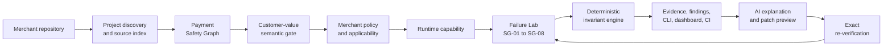

# StateGuard

<p align="center">
  <strong>Your payment integration works once. StateGuard proves what happens next.</strong>
</p>

<p align="center">
  
  
  
  
</p>

> **StateGuard is a local-first reliability auditor for Razorpay integrations.** It reconstructs
> the payment safety path through a Python/FastAPI codebase, identifies the action that actually
> delivers customer value, and adversarially verifies whether that action remains correct when
> payment events are duplicated, forged, retried, delayed, missing, or out of order.

Built for the **Razorpay AI Buildathon — Open Track**.

---

## The happy path is not the hard part

A Checkout succeeds. A webhook arrives. An order becomes paid. The demo works.

But production payment failures live between those steps:

- the same webhook is delivered twice;
- a valid event is retried after an unsuccessful acknowledgement;
- a forged webhook reaches mutation code;
- a browser callback is tampered with—or never returns;
- an older payment event arrives after a newer one;
- the code marks an order paid before the payment state allowed by the merchant's policy.

These are not ordinary lint findings. They are questions about **trust, ordering, idempotency,
merchant policy, and the exact point where customer value is delivered**.

StateGuard turns those questions into executable invariants with inspectable evidence.

## A real failure, proven

The included ticketing merchant looks reasonable: it verifies the Razorpay webhook signature,
records payment state, and mints an admission pass. Its duplicate-event check is simply in the
wrong place—after fulfilment.

StateGuard traced the exact confirmed customer-value action, delivered the adversarial sequences,
and produced this real run:

```text
StateGuard verification run
status: COMPLETED
verified_pass: 7
verified_fail: 2
unverified: 0
dynamic_coverage: 9/9
findings: 2

SG-01 VALUE_EXACTLY_ONCE_AT_POLICY_THRESHOLD: VERIFIED PASS
SG-02 DUPLICATE_VALUE_AT_MOST_ONCE:           VERIFIED FAIL
SG-03 RETRY_VALUE_AT_MOST_ONCE:               VERIFIED FAIL
```

The fix moves the event claim before merchant mutation and admission-pass minting. StateGuard's AI
assistance can explain that failure and preview a bounded patch, but the preview remains visibly
`AI-GENERATED — NOT VERIFIED`. Only an exact deterministic re-run can change the result:

```text
SG-02 VERIFIED FAIL → VERIFIED PASS / PROVEN_RESOLVED

verified_pass: 9
verified_fail: 0
unverified: 0
dynamic_coverage: 9/9
findings: 0
```

Both outputs above come from the real production path in
[`examples/ticketing_merchant`](examples/ticketing_merchant)—not fabricated dashboard data.

## The key design decision: AI is useful, not authoritative

Most tools either avoid semantic reasoning or let an LLM make the final judgment. StateGuard does
neither.

| Question | Authority |
|---|---|
| Where are the payment ingress, trust gates, mutations, and acknowledgements? | Deterministic source analysis |
| Which merchant function actually delivers what the customer paid for? | AI suggestion, with human resolution when consequentially ambiguous |
| What payment policy does this merchant intend? | Explicit merchant confirmation |
| Which scenarios apply to this integration? | Deterministic graph and policy analysis |
| Did an invariant pass or fail? | **Deterministic execution evidence only** |
| What caused a proven failure, and how might it be fixed? | Bounded AI assistance |
| Is the proposed fix correct? | **Deterministic re-verification only** |

> **AI proposes meaning or remediation. StateGuard proves behavior.**

That boundary is not theoretical. In the frozen semantic experiment, Gemini improved unique mapping
coverage from **50% to 83.33%** and found **4 additional seeded defects**, but the ticketing domain
still produced two plausible customer-value candidates:

```text
app.domain.mint_admission_pass
app.domain.bind_attendee_roster_row
```

The predeclared experiment outcome remains honestly **`NO_GO`**. Production StateGuard therefore
surfaces the ambiguity and requires a human decision instead of silently guessing. See
[`spike-test/`](spike-test) for the frozen contract and artifacts.

## How it works



The **Payment Safety Graph** is the backbone, not a decorative visualization. It connects:

- payment ingress such as Razorpay webhooks and Checkout callbacks;
- signature verification and server-side order binding;
- event identity and replay guards;
- payment-state branches;
- merchant state mutations;
- the confirmed customer-value action;
- the acknowledgement boundary;
- exact source provenance for every supported claim.

## Failure Lab

StateGuard ships a fixed, inspectable Razorpay-focused scenario suite. Applicability is computed per
integration; a missing prerequisite becomes `NOT APPLICABLE`, `NEEDS INPUT`, or `UNVERIFIED`—never a
convenient PASS.

| Scenario | What StateGuard checks |
|---|---|
| **SG-01 · Normal capture** | Customer value occurs exactly once at the confirmed policy threshold. |
| **SG-02 · Duplicate webhook** | Re-delivering one event cannot grant customer value twice. |
| **SG-03 · Acknowledgement retry** | A modeled retry after an unsuccessful acknowledgement adds no second value action. |
| **SG-04 · Out-of-order event** | An older authorized event adds no value and does not regress applicable merchant state. |
| **SG-05 · Forged webhook** | Invalid webhook trust causes neither protected mutation nor customer value. |
| **SG-06 · Tampered Checkout callback** | Mismatched order identity or signature cannot create a trusted paid outcome. |
| **SG-07 · Lost browser callback** | The server-side webhook path can still reach the correct outcome without browser completion. |
| **SG-08 · Late authorisation** | Pre-capture and post-capture behavior follows the merchant-confirmed late-payment policy. |

## Run the proof locally

### 1. Install

StateGuard currently targets Python **3.11** and uses [`uv`](https://docs.astral.sh/uv/).

```console
git clone https://github.com/Driv1216/StateGuard.git
cd StateGuard
uv sync --extra managed-fastapi
uv run stateguard --version
```

### 2. Reset the deliberately vulnerable merchant

The reset utility is strictly contained to the example directory. It restores the selected demo
source, clears only demo-local StateGuard artifacts and SQLite state, and never reads provider
credentials.

```console
uv run python examples/ticketing_merchant/reset_demo.py vulnerable

export SG_DEMO_WEBHOOK_SECRET=local-demo-webhook-secret
export SG_DEMO_CHECKOUT_SECRET=local-demo-checkout-secret
export SG_DEMO_SERVER_ORDER_ID=order_stateguard_demo
```

### 3. Establish meaning and policy

This copy-paste path uses explicit human confirmation, so no model key is required:

```console
uv run stateguard analyze examples/ticketing_merchant

uv run stateguard semantics confirm examples/ticketing_merchant \
  --symbol app.domain.mint_admission_pass

uv run stateguard policy confirm examples/ticketing_merchant \
  --fulfilment CAPTURE_REQUIRED \
  --late-authorisation DO_NOT_FULFIL
```

To exercise the AI semantic path instead, configure `GEMINI_API_KEY` and run:

```console
uv run stateguard semantics resolve examples/ticketing_merchant
```

Model output remains a suggestion when the bundle is partial or the mapping is ambiguous. Confirm
the exact symbol before fulfilment-specific verification.

### 4. Verify and inspect

```console
uv run stateguard verify examples/ticketing_merchant
uv run stateguard serve examples/ticketing_merchant
```

Open **<http://127.0.0.1:8765>** to explore the five dashboard surfaces:

1. **Overview** — project authority, semantic state, runtime capability, and latest run;
2. **Safety Graph** — the reconstructed trust and customer-value path with source provenance;
3. **Failure Lab** — scenario applicability, results, and evidence tiers;
4. **Findings** — deterministic traces, assistance, and re-verification state;
5. **Project Setup** — typed AI, policy, runtime, and CI configuration.

### 5. Prove the correction

```console
uv run python examples/ticketing_merchant/reset_demo.py fixed

uv run stateguard semantics confirm examples/ticketing_merchant \
  --symbol app.domain.mint_admission_pass

uv run stateguard policy confirm examples/ticketing_merchant \
  --fulfilment CAPTURE_REQUIRED \
  --late-authorisation DO_NOT_FULFIL

uv run stateguard verify examples/ticketing_merchant --ci
```

The corrected demo has produced 9 dynamic verified passes, no verified failures, no unverified
checks, and an exit-0 `REQUIRED_CHECKS_PASSED` CI gate. The managed-runtime repetition gate produced
the expected result across **5/5 vulnerable and 5/5 corrected runs**, with clean termination and no
leftover bound ports or scratch directories.

## Evidence without invented certainty

Every result retains the strength and provenance of its evidence:

| Tier | Meaning |
|---|---|
| `E0 DISCOVERED` | A structural or source fact was found. |
| `E1 RESOLVED` | Semantic meaning or merchant policy was established. |
| `E2 STATIC VERIFIED` | Code structure strongly supports a specific static verification claim. |
| `E3 DYNAMIC VERIFIED` | StateGuard executed the scenario and observed deterministic behavior. |
| `E4 RAZORPAY GROUNDED` | Optional sanitized Razorpay Test Mode resource evidence additionally grounds SG-01's input profile. |

The user-facing result vocabulary stays deliberately factual:

```text
VERIFIED PASS · VERIFIED FAIL · STATIC WARNING
NEEDS INPUT · UNVERIFIED · NOT APPLICABLE
```

Only `VERIFIED FAIL` receives critical failure treatment. Static evidence is never represented as
runtime proof, and StateGuard does not manufacture an unexplained “safety score.”

## CI is the same verifier, not a second truth system

```console
uv run stateguard verify /path/to/repo --ci
uv run stateguard verify /path/to/repo --ci --json
```

`verify --ci` creates the same immutable canonical run as ordinary verification, then applies a
deterministic release-gate projection:

| Exit | Meaning |
|---:|---|
| `0` | Applicable required checks passed. |
| `1` | At least one core or optional check produced a deterministic `VERIFIED FAIL`. |
| `2` | Required verification was not proven, including zero applicable core checks. |
| `3` | Usage or operational failure prevented a valid gate result. |

Completed gate JSON is written to stdout for exits `1` and `2`; safe operational error JSON is
written to stderr for exit `3`. `NOT APPLICABLE` is never relabeled as PASS.

## Optional Razorpay Test Mode grounding

An existing captured Test Mode Payment and its linked paid Order can strengthen one already
successful SG-01 check from E3 to `E4 RAZORPAY GROUNDED`:

```console
uv run stateguard verify /path/to/repo \
  --razorpay-test-payment-id-env RAZORPAY_PAYMENT_ID \
  --razorpay-test-key-id-env RAZORPAY_KEY_ID \
  --razorpay-test-key-secret-env RAZORPAY_KEY_SECRET
```

StateGuard accepts **environment-variable names**, not credential values. It rejects Live or unknown
key modes before network access, fetches without mutating either resource, and persists only
sanitized fingerprints.

E4 means **Test Mode resource-profile grounding**. It does not claim evidence of Razorpay webhook
delivery, signature verification, retries, duplicates, or provider execution. If provider evidence
is unavailable, the ordinary E3 result and CI truth remain unchanged.

## Supported today

- Python 3.11 repositories;
- FastAPI as the fully supported backend framework;
- Razorpay Payment Gateway surfaces for Standard Checkout and payment webhooks;
- managed local execution, bring-your-own non-production test targets, and static-only degradation;
- Gemini and OpenAI-compatible semantic/remediation adapters behind a StateGuard-owned interface;
- CLI, loopback-only local dashboard/API, immutable run history, and CI gating;
- bounded patch previews that never modify merchant code automatically.

StateGuard is intentionally **not** a generic security scanner, payment integration generator,
production observability service, or cloud arbitrary-code runner. It performs no real-money chaos,
does not execute merchant code in production, and does not turn unavailable runtime evidence into a
PASS.

## Configuration

`stateguard.yaml` contains typed project, analysis, provider, policy, and runtime metadata. Provider
credentials are always referenced by environment-variable name; secret values must never be stored
in the file.

```yaml
schema_version: 2
project:
  id: sgproj_0123456789abcdef0123456789abcdef
  source_root: .
  framework: fastapi
  app_target: app.main:app
analysis:
  include: ["**/*.py"]
  exclude: [".venv/**", ".git/**", ".stateguard/**"]
ai:
  provider: gemini
  model: your-structured-output-model
  api_key_env: GEMINI_API_KEY
runtime:
  mode: static
```

Use `provider: openai-compatible` with an HTTPS `base_url` for a compatible Chat Completions
endpoint. Configure runtime and policy through the CLI/dashboard so generated authority
fingerprints stay consistent with the analyzed source.

Managed runtime secrets follow an explicit host-to-child mapping. Only names enter configuration or
authority fingerprints; secret values and request signatures are excluded from persisted artifacts
and diagnostics. Missing mappings fail closed as `UNVERIFIED`.

See [`docs/RUNTIME_CAPABILITY.md`](docs/RUNTIME_CAPABILITY.md) for lifecycle facts, tested runtime
compatibility, target safety boundaries, and managed/BYO/static configuration modes.

## CLI map

```console
uv run stateguard config validate /path/to/stateguard.yaml
uv run stateguard analyze /path/to/repo --json
uv run stateguard semantics resolve /path/to/repo
uv run stateguard semantics confirm /path/to/repo --symbol package.module.callable
uv run stateguard policy confirm /path/to/repo --fulfilment CAPTURE_REQUIRED
uv run stateguard applicability analyze /path/to/repo
uv run stateguard runtime assess /path/to/repo
uv run stateguard verify /path/to/repo
uv run stateguard serve /path/to/repo
uv run stateguard runs list /path/to/repo
uv run stateguard runs latest /path/to/repo
```

Human-readable and typed JSON surfaces share the same application core. Project paths are positional;
the hidden `--repository` alias remains only for compatibility.

## Development

```console
uv sync --extra managed-fastapi
uv run pytest
uv run ruff check src tests
uv run ruff format --check src tests
uv run mypy src
uv build
```

Use proportional verification while developing: focused tests for isolated changes, subsystem gates
for coherent batches, and the broader suite for release/demo gates. The frozen experiment under
`spike-test/` must not be rerun or tuned as though its original outcome can change.

## Project truth and deeper reading

- [`docs/STATEGUARD_CONTEXT.md`](docs/STATEGUARD_CONTEXT.md) — accepted product architecture,
  invariants, Razorpay rule catalog, scope, and permanent principles;
- [`docs/CURRENT_STATE.md`](docs/CURRENT_STATE.md) — current implementation status, completed proof,
  verification record, and known limitations;
- [`docs/RUNTIME_CAPABILITY.md`](docs/RUNTIME_CAPABILITY.md) — runtime authority, instrumentation,
  isolation, and target-safety contract;
- [`spike-test/`](spike-test) — immutable semantic experiment contract and its `NO_GO` result;
- [`examples/ticketing_merchant/`](examples/ticketing_merchant) — the vulnerable-to-corrected product
  walkthrough.

---

<p align="center">
  <strong>Integration tools help build the payment path.<br>StateGuard reconstructs and adversarially verifies it.</strong>
</p>
